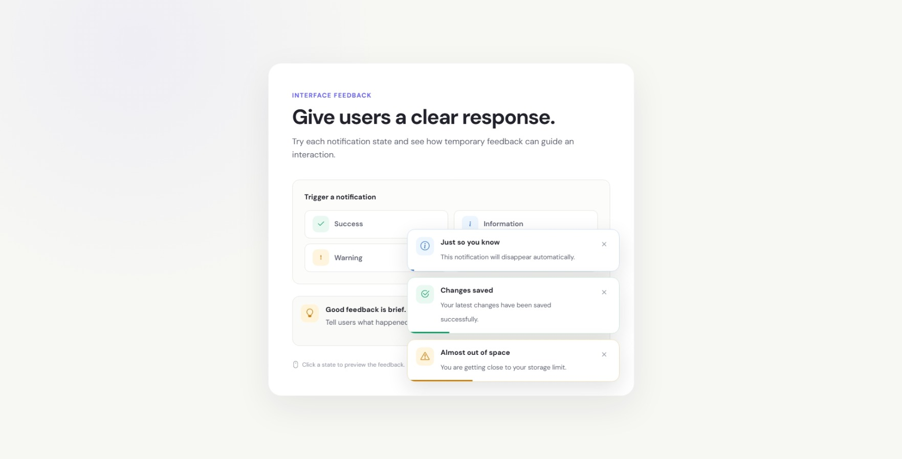

# Mini Challenge #04 — Interactive Toast Notification System

A focused frontend mini challenge built around a common product interaction: giving users temporary feedback after an action.

The project demonstrates how a notification system can communicate success, information, warnings, and errors without interrupting the user's workflow.

The design intentionally stays simple and human-centered, focusing on **clarity, hierarchy, accessibility, and purposeful animation** instead of excessive visual decoration.

---

## Project Overview

The **Interactive Toast Notification System** is a responsive frontend component that demonstrates four common feedback states:

- Success
- Information
- Warning
- Error

Users can trigger each notification from the interface.

Notifications:

- Appear with a short entrance animation
- Communicate a clear message
- Include a manual close button
- Automatically dismiss after a short period
- Display a progress indicator
- Support keyboard dismissal
- Adapt to smaller screens
- Respect reduced-motion preferences

The entire component is built with HTML5, CSS3, Bootstrap 5, and Vanilla JavaScript.

---

## Main Focus

This mini challenge focuses on:

- Toast notifications
- UI feedback patterns
- DOM element creation
- Dynamic content
- JavaScript event handling
- Automatic timers
- CSS animations
- Status states
- Accessibility
- Keyboard interaction
- Responsive design
- Micro-interactions

The goal is to understand how a small feedback system can be designed and implemented without turning it into a large application.

---

## Screenshot

Add your final screenshot after completing the project.

```text
assets/
└── images/
    └── screenshot.jpeg
```

Example:





---

## Challenge Goals

The main goals of this challenge were:

1. Understand the purpose of toast notifications.
2. Create multiple feedback states.
3. Generate notification elements dynamically with JavaScript.
4. Add automatic dismissal.
5. Add manual dismissal.
6. Create entrance and exit animations.
7. Add a visual timeout indicator.
8. Practice DOM manipulation.
9. Practice JavaScript timers.
10. Add keyboard interaction.
11. Practice accessibility semantics.
12. Keep the component responsive.
13. Limit notification stacking.
14. Use animation to communicate state changes.
15. Create a polished interaction without unnecessary visual decoration.

---

## Technologies Used

### HTML5

Used for:

- Semantic page structure
- Buttons
- Sections
- Accessible labels
- Notification container
- ARIA attributes

### CSS3

Used for:

- Layout
- Responsive design
- Component styling
- Status colors
- Hover states
- Focus states
- Toast animations
- Progress animation
- Reduced-motion support

### Bootstrap 5

Used for:

- Supporting the responsive frontend
- Bootstrap Icons

The primary visual design is handled using custom CSS.

### Vanilla JavaScript

Used for:

- Dynamic toast creation
- Notification content
- Event handling
- Automatic dismissal
- Manual dismissal
- Keyboard interaction
- Toast stacking
- DOM manipulation

### Google Fonts

**DM Sans** is used for the interface typography.

---

## Project Structure

```text
mini-toast-notification-system/
│
├── index.html
├── style.css
├── script.js
│
├── assets/
│   └── images/
│       └── screenshot.jpeg
│
└── README.md
```

---

## Features

### 1. Success Notification

The success state communicates that an action has completed successfully.

Example:

```text
Changes saved
Your latest changes have been saved successfully.
```

---

### 2. Information Notification

The information state communicates neutral information.

Example:

```text
Just so you know
This notification will disappear automatically.
```

---

### 3. Warning Notification

The warning state draws attention to something that may require action.

Example:

```text
Almost out of space
You are getting close to your storage limit.
```

---

### 4. Error Notification

The error state communicates that an action could not be completed.

Example:

```text
Something went wrong
We couldn't complete that action. Please try again.
```

Error notifications use stronger accessibility semantics through:

```html
role="alert"
```

---

### 5. Automatic Dismissal

Notifications automatically disappear after a short period.

The default duration is:

```javascript
const TOAST_DURATION = 3800;
```

This prevents temporary messages from remaining on the screen unnecessarily.

---

### 6. Manual Dismissal

Every notification includes a close button.

Users do not have to wait for the automatic timeout.

---

### 7. Animated Entrance

New notifications enter with a subtle:

```text
fade + upward movement + slight scale
```

The animation provides context that a new notification has appeared.

---

### 8. Animated Exit

When dismissed, the notification uses a short exit animation before being removed from the DOM.

This avoids an abrupt visual disappearance.

---

### 9. Progress Indicator

A small progress line appears at the bottom of each notification.

It communicates approximately how much time remains before automatic dismissal.

---

### 10. Notification Stack Limit

The interface limits the visible notification stack to three notifications.

This prevents the screen from becoming crowded if the user repeatedly triggers notifications.

---

### 11. Escape Key

Pressing:

```text
Escape
```

dismisses the latest visible notification.

This provides a small keyboard-friendly interaction.

---

### 12. Responsive Layout

The notification system adapts to:

- Desktop
- Tablet
- Mobile
- Small mobile screens

The notification buttons become a single column on very small screens.

---

### 13. Reduced Motion

The interface respects:

```text
prefers-reduced-motion
```

Animations and transitions are minimized when the user's system requests reduced motion.

---

## Design Approach

The interface follows a simple principle:

> Feedback should help the user understand what happened without interrupting their task.

The design therefore avoids unnecessary elements such as:

- Large illustrations
- Decorative gradients
- Glassmorphism
- Excessive shadows
- Giant notification cards
- Long notification messages
- Unnecessary buttons
- Decorative animation

The notification itself remains compact.

---

## Notification Hierarchy

Each toast follows the same structure:

```text
Status icon
      ↓
Short title
      ↓
Supporting message
      ↓
Dismiss
```

This creates predictable information hierarchy.

Users can quickly scan:

**what happened → why → dismiss**

---

## Status Design

The four states have different meanings.

| State | Purpose |
|---|---|
| Success | Action completed |
| Information | Neutral information |
| Warning | Attention may be required |
| Error | Action failed |

Color is used as supporting information rather than the only method of communicating the state.

Each state also includes an appropriate icon and message.

---

## Animation Approach

Animation is intentionally restrained.

### Entrance

The notification fades in while moving upward slightly.

### Exit

The notification fades out and moves slightly downward.

### Progress

The bottom progress indicator reduces over the notification lifetime.

### Hover

Interactive buttons receive small movement and background changes.

The goal is:

**motion that explains change rather than decoration for decoration's sake.**

---

## JavaScript

The notification system is generated dynamically.

The main function is:

```javascript
createToast(type);
```

The function:

1. Finds the notification content.
2. Creates the notification element.
3. Creates the icon.
4. Creates the title.
5. Creates the description.
6. Creates the close button.
7. Creates the progress indicator.
8. Adds the notification to the page.
9. Starts the automatic dismissal timer.
10. Applies the appropriate accessibility role.

---

## Notification Data

The notification content is stored in one JavaScript object:

```javascript
const notificationData = {
    success: {},
    info: {},
    warning: {},
    error: {}
};
```

This makes it easier to add or modify notification states without duplicating the creation logic.

---

## Automatic Dismissal

Each notification receives its own timeout.

```javascript
const TOAST_DURATION = 3800;
```

The timeout is stored on the toast element so it can be cleared if the user manually dismisses the notification.

---

## Accessibility

Accessibility was considered as part of the interaction design.

The component includes:

- Semantic buttons
- Accessible close buttons
- `aria-live`
- `aria-atomic`
- `role="status"`
- `role="alert"` for errors
- Visible keyboard focus
- Escape-key dismissal
- Reduced-motion support

Error notifications use `role="alert"` because they represent important feedback that may require immediate attention.

---

## How to Run Locally

### 1. Clone the repository

```bash
git clone https://github.com/codingwithvignesh/mini-toast-notification-system.git
```

### 2. Open the project

```bash
cd mini-toast-notification-system
```

### 3. Open `index.html`

Open the file directly in your browser.

For development, VS Code with Live Server can also be used.

---

## Live Demo

Add the Netlify deployment URL after publishing the project.

```text
https://your-project-name.netlify.app
```

Example:

```markdown
[View Live Demo](https://your-project-name.netlify.app)
```

---

## What I Practiced

Through this mini challenge, I practiced:

- HTML5 structure
- CSS component design
- Responsive layouts
- Vanilla JavaScript
- DOM creation
- DOM manipulation
- Event listeners
- JavaScript timers
- Dynamic content
- Notification patterns
- UI feedback
- Status states
- CSS animations
- CSS transitions
- Keyboard interaction
- Accessibility
- ARIA attributes
- Focus states
- Reduced-motion support
- Responsive UI
- Micro-interactions

---

## Development Workflow

### Step 1 — Structure

Created the notification playground using HTML5.

Focused on:

- Page hierarchy
- Trigger buttons
- Notification container
- Accessibility structure

### Step 2 — Styling

Created the visual system using CSS.

Focused on:

- Typography
- Spacing
- Status colors
- Borders
- Shadows
- Responsive behavior
- Interaction states

### Step 3 — Interaction

Added JavaScript functionality for:

- Notification creation
- Notification types
- Dynamic DOM elements
- Auto-dismiss
- Manual dismissal
- Toast stacking

### Step 4 — Animation

Added:

- Toast entrance animation
- Toast exit animation
- Progress animation
- Button hover feedback

### Step 5 — Accessibility

Added:

- ARIA live region
- Status roles
- Error alert semantics
- Keyboard dismissal
- Focus states
- Reduced-motion support

### Step 6 — Testing

Tested the interface across:

- Desktop
- Tablet
- Mobile
- Multiple notifications
- Keyboard interaction
- Reduced-motion settings

---

## Testing Checklist

### Notification States

- [ ] Success notification works.
- [ ] Information notification works.
- [ ] Warning notification works.
- [ ] Error notification works.
- [ ] Correct icon appears.
- [ ] Correct title appears.
- [ ] Correct description appears.

### Interaction

- [ ] Notification appears after clicking a button.
- [ ] Notification can be closed manually.
- [ ] Notification automatically disappears.
- [ ] Escape closes the latest notification.
- [ ] Multiple notifications can be triggered.

### Animation

- [ ] Toast entrance animation works.
- [ ] Toast exit animation works.
- [ ] Progress animation works.
- [ ] Button hover states work.
- [ ] Reduced-motion preference works.

### Accessibility

- [ ] Buttons are keyboard accessible.
- [ ] Close buttons have accessible labels.
- [ ] Notification region uses live feedback.
- [ ] Error notifications use alert semantics.
- [ ] Focus states are visible.
- [ ] Escape key works.

### Responsive

- [ ] Desktop layout works.
- [ ] Tablet layout works.
- [ ] Mobile layout works.
- [ ] Small mobile layout works.
- [ ] Toasts remain readable.
- [ ] Notification stack stays within the viewport.

---

## Future Improvements

Possible future improvements include:

- Pause auto-dismiss while hovering
- Swipe-to-dismiss on mobile
- Optional action buttons
- Notification history
- Different notification durations
- Undo actions
- Sound preferences
- Reusable notification JavaScript module
- Automated accessibility testing

These improvements are intentionally outside the current mini challenge.

The current goal is to understand the fundamental toast notification interaction first.

---

## Browser Support

The project is designed for modern browsers supporting:

- HTML5
- CSS3
- JavaScript ES6+
- CSS custom properties
- CSS animations
- ARIA attributes

Recommended browsers:

- Google Chrome
- Microsoft Edge
- Mozilla Firefox
- Safari

---

## Author

**Vignesh Govindaraj**

UI/UX Designer • Front-End Developer

### Portfolio

https://vigneshux.netlify.app/

### GitHub

https://github.com/codingwithvignesh

### Behance

https://www.behance.net/vigneshgovindaraj

---

## HTML, CSS & JavaScript Challenge

This project is part of my frontend mini challenge series.

The purpose of these challenges is to consistently practice small, focused interface interactions rather than immediately building large applications.

The learning pattern is:

```text
HTML
  ↓
CSS
  ↓
JavaScript
  ↓
Interactive UI
```

The project pattern is:

```text
STRUCTURE
    •
STYLE
    •
INTERACTION
```

This challenge specifically focuses on:

**UI Feedback • Toast Notifications • DOM Manipulation • Animation • Accessibility**

---

## Personal GitHub Topic

Projects in this challenge series use my personal GitHub topic:

```text
vignesh-builds
```

This identifies projects that I personally build as part of my UI/UX and frontend development practice.

---

## License

This project is created for educational and personal portfolio purposes.

You are welcome to explore the code and use the ideas for learning.

---

**Built with HTML5, CSS3, Bootstrap 5, and Vanilla JavaScript.**